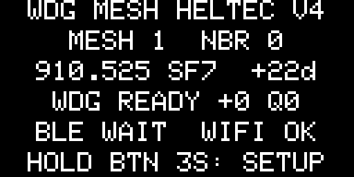

# Canadaverse WDG Mesh Sidecar

Open-source MeshCore companion firmware for WDGWars wardrives. Carry one
supported Heltec beside a Biscuit Pro or another Wi-Fi wardriver: the primary
device records 2.4/5 GHz access points, while this sidecar receives live
MeshCore node adverts and sends eligible locations directly to WDGWars.

The sidecar does **not** scan Wi-Fi, call WiGLE, import old logs, or perform a
history sweep. It handles live MeshCore traffic from the current boot only.

## Hardware and release status

| Device | MCU | Display | Release-candidate status |
| --- | --- | --- | --- |
| Heltec RCC6 prototype | ESP32-C6 | 220x128 NV3001B TFT | Built and hardware tested |
| Heltec LoRa 32 V3 | ESP32-S3 | 128x64 OLED | Built; hardware qualification tracked in release evidence |
| Heltec LoRa 32 V4/V4.3 | ESP32-S3 | 128x64 OLED | Builds successfully; physical qualification required before stable status |

Use the [Canadaverse web flasher](https://flasher.canadaverse.org/) for
published, board-specific images. The flasher checks the connected chip and
device profile before writing. Do not install a V3 image on V4/V4.3 or an RCC6
image on either ESP32-S3 board.

## What it does

- Listens on the Canadian MeshCore narrow preset: `910.525 MHz`, `62.5 kHz`,
  `SF7`, `CR 4/5`, private sync word, and 32-symbol preamble.
- Validates signed MeshCore adverts with the pinned official MeshCore library.
- Uploads only nodes with valid, signed latitude and longitude using WDGWars'
  `meshcore_nodes` schema and HMAC authentication.
- Uses a bounded RAM queue: 32 unique nodes, 15-minute expiry, 15-second quiet
  flush, and a 60-second maximum batch wait.
- Never automatically replays a batch after a POST attempt, because a lost
  response could mean WDGWars accepted it.
- Suppresses duplicate adverts and repeated submissions during the current
  boot.
- Optionally performs conservative blank-password guest polling of a directly
  observed repeater. Neighbour replies do not contain GPS and are never
  treated as a location source.
- Provides a captive setup portal, on-device status display, safe serial logs,
  and an optional Biscuit-compatible BLE diagnostic/status service.

## Normal wardrive workflow

1. Configure the sidecar once with the same 2.4 GHz phone hotspot you use while
   driving and a WDGWars API key.
2. Connect Biscuit Manager to the Biscuit Pro and start the Wi-Fi wardrive.
3. Power the Mesh Sidecar. Its display should reach `WDG READY`.
4. Drive normally. The Pro owns Wi-Fi/BLE collection; the sidecar independently
   submits only live, located MeshCore nodes.

Android can keep the Biscuit Pro BLE connection and the phone hotspot active
at the same time. The sidecar does not need a second Biscuit Manager
connection to upload. Biscuit Manager currently has no native MeshCore record
type, so its optional BLE connection is for setup/status compatibility rather
than carrying MeshCore records through the app.

## First-time setup

If no valid configuration exists, the display shows a temporary `WDG-*` Wi-Fi
name, a device-generated 8-digit WPA2 PIN, and `192.168.4.1`.

1. Join the setup Wi-Fi shown on the display.
2. Open `http://192.168.4.1` if the captive page does not open automatically.
3. Enter the 2.4 GHz hotspot name/password and the 64-character **WDGWars API
   key**. Do not enter a WiGLE ID or WiGLE API credential.
4. Save and restart, then enable the hotspot.

Hold the device user button for three seconds to reopen setup at any time. The
form never echoes a stored password or key, and serial/BLE command logs report
only command names and byte counts.

Credentials live in the ESP32 Preferences/NVS partition. They are absent from
source, Git, release files, flasher manifests, BLE responses, and logs. Default
ESP32 flash is not encrypted, so someone with physical flash-read access could
still recover NVS data. An app-only web update at `0x10000` preserves NVS; a
full recovery flash may erase it.

For enclosed or headless installs, the guided Canadaverse flasher can provision
the same values over USB after the app image is verified. The fields remain in
browser memory only, the firmware never echoes them, and they are cleared from
the page after the device confirms that they were saved.

## Safety boundaries

- No Wi-Fi scanning or WiGLE API access.
- No CSV import, transaction enumeration, historical session loading, catch-up,
  bulk import, or backfill.
- No persistent upload queue. Rebooting clears pending and attempted-node RAM.
- No synthetic location. Missing, invalid, or `0,0` coordinates are skipped.
- No admin login, attack command, flooded login, or mesh forwarding.
- Repeater polling is limited to a signed repeater advert heard directly or
  through one advertised hop, one attempt per repeater per 30 minutes per boot,
  and at most eight neighbour entries.
- Active polling begins only after WDGWars authentication succeeds.

## Build

Install PlatformIO Core, then build one exact target:

```powershell
pio run -e rcc6_wdg_mesh
pio run -e heltec_v3_wdg_mesh
pio run -e heltec_v4_wdg_mesh
```

Or build the complete matrix with `pio run`. The board-specific app images are:

```text
.pio/build/rcc6_wdg_mesh/firmware.bin
.pio/build/heltec_v3_wdg_mesh/firmware.bin
.pio/build/heltec_v4_wdg_mesh/firmware.bin
```

For a wired development flash, identify the exact board and port first, then:

```powershell
pio run -e rcc6_wdg_mesh -t upload --upload-port COM21
```

Substitute the correct environment and verified port for V3 or V4. Never infer
the hardware generation from an old port name.

For release evidence, the running firmware can return exactly one display
frame over the verified USB serial port. This is an on-demand diagnostic and
is silent during normal operation:

```powershell
python tools/capture_screen.py --port COM21 --output evidence/rcc6-screen.png
```

The capture tool checks the framebuffer dimensions and CRC before writing the
PNG. Substitute the exact verified port; opening an unrelated serial device is
not a valid qualification step.

## Heltec V4 hardware validation

The V4 release candidate was exercised on a physical WiFi LoRa 32 V4/V4.3 with
the display, Canada MeshCore preset, WDGWars uplink, USB provisioning, and
Biscuit-compatible BLE service active together:



See [`evidence/V4_HARDWARE_VALIDATION.md`](evidence/V4_HARDWARE_VALIDATION.md)
for the bounded validation record. The device was enclosed, so the image is a
CRC-verified capture of the framebuffer actually sent to its OLED driver.

## Protocol notes

The optional BLE/USB status stream emits genuine MeshCore data as:

```text
DATA:MESHCORE:<node_id>,<node_type>,<name>,<lat>,<lon>,<rssi>,<snr>,<advert_timestamp>,<public_key>,<path_hops>
```

It never disguises MeshCore observations as Wi-Fi, Bluetooth, or 802.15.4.
WDGWars node IDs are the first four public-key bytes, matching WatchDogsGo.

The display/pin support derives from the public NeonPocketMC board projects.
Packet routing, identity, signature validation, and guest requests use pinned
[`meshcore-dev/MeshCore`](https://github.com/meshcore-dev/MeshCore) sources.
WDGWars payload/authentication behavior follows
[`LOCOSP/WatchDogsGo`](https://github.com/LOCOSP/WatchDogsGo). See
[`THIRD_PARTY_NOTICES.md`](THIRD_PARTY_NOTICES.md).

This community firmware is unofficial and is not affiliated with or endorsed
by WDGWars/WatchDogsGo, Biscuit Shop, Heltec Automation, or MeshCore.
